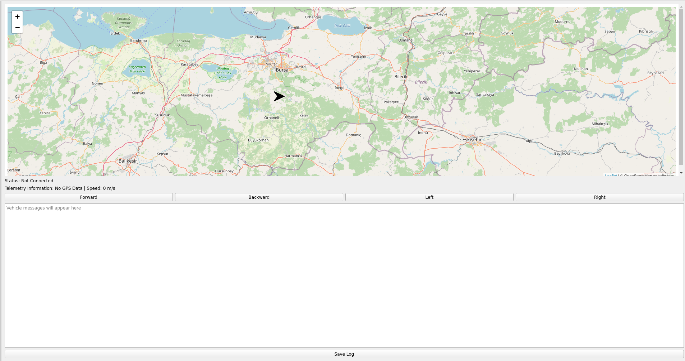

# Ground Control Station (PyQt5)

# Dependencies
```bash
pip install folium
pip install PyQtWebEngine
sudo apt install libqt5webengine5 libqt5webenginewidgets5
```

### Installation
```bash
cd && mkdir -p ground_control_station/src
cd ground_control_station/src
git clone https://github.com/furkansariyildiz/ground_control_station.git
colcon build --symlink-install --pacakges-select ground_control_station
```

### Running package
```bash
cd ground_control_station
source install/setup.bash
ros2 run ground_control_station ground_control_station
```

<p align="center">
  
</p>

# Troubleshooting
If package returns **ImportError: /usr/local/lib/python3.10/dist-packages/PyQt5/Qt5/lib/libQt5WebEngineCore.so.5: undefined symbol:** error, try to install **python3-qtpy**
```bash
sudo apt install python3-qtpy
```